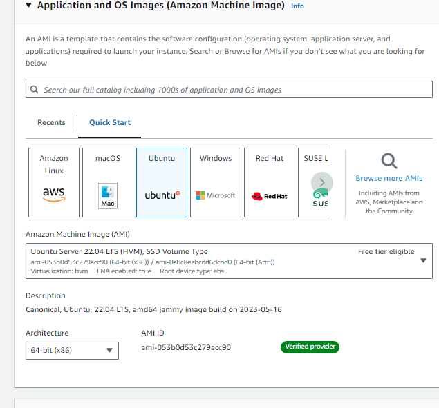
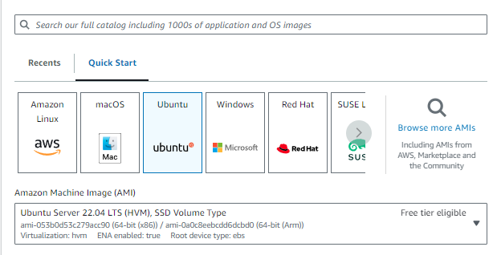
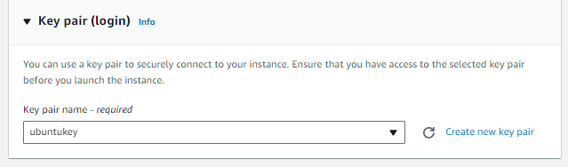
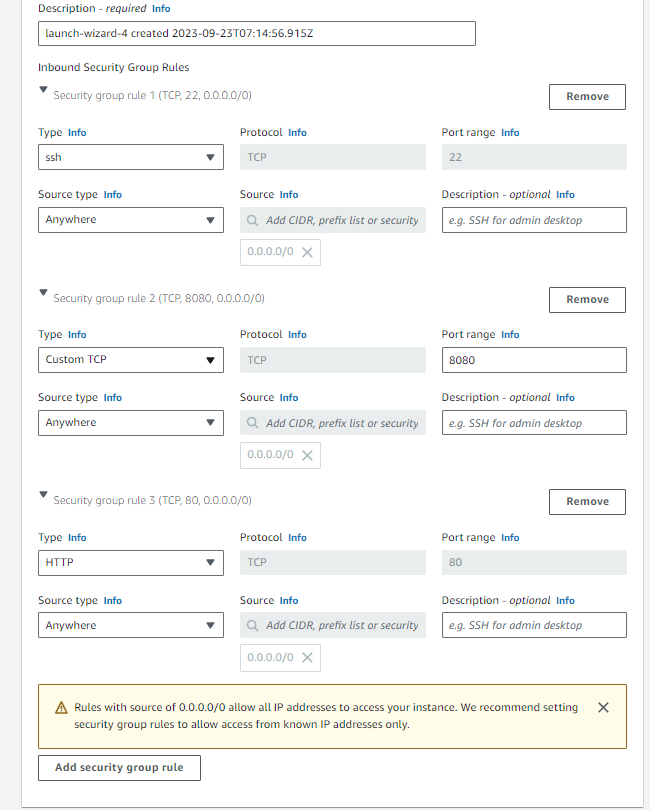
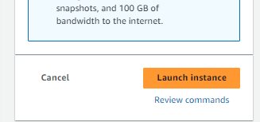
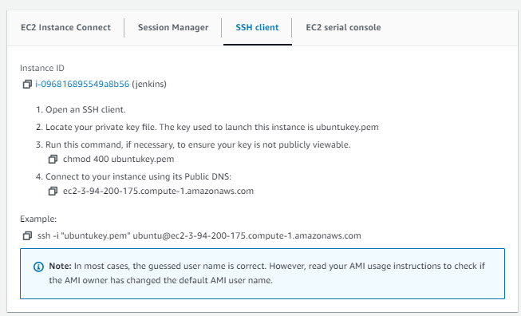
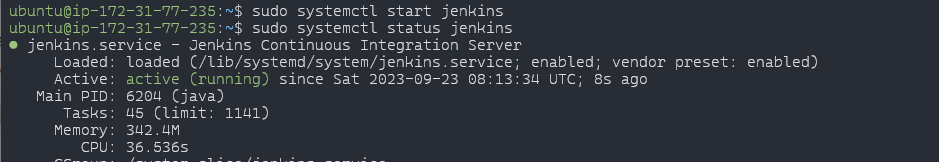
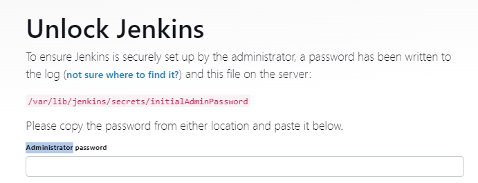

# aws-jenkins

# How to Install jenkins (aws ubuntu server)


1. <h2>Select ubuntu imaage </h2>
> 

2. <h2> Select instance type </h2>

> 

3. <h2>Select ubuntu key for ssh</h2>


4. <h2>For the network setting make sure it has port 8080 is available. Because jenkins runs on port 8080</h2>
> 

5. <h2>Click launch<h2>
> 

6. <h2>Copy the ssh command and paste it in your terminal</h2>
> 

7. <h2>Copy paste below command to update the repository in the machine and install jenkins</h2>


```
curl -fsSL https://pkg.jenkins.io/debian-stable/jenkins.io-2023.key | sudo tee \
  /usr/share/keyrings/jenkins-keyring.asc > /dev/null
echo deb [signed-by=/usr/share/keyrings/jenkins-keyring.asc] \
  https://pkg.jenkins.io/debian-stable binary/ | sudo tee \
  /etc/apt/sources.list.d/jenkins.list > /dev/null
```

```
sudo apt-get update
```

```
sudo apt-get install jenkins
```
8. <h2>Make sure java installed</h2>

* To check java installed
```
java -v
```

* To install java
```
sudo apt update
sudo apt install openjdk-17-jre
java -version
openjdk version "17.0.7" 2023-04-18
OpenJDK Runtime Environment (build 17.0.7+7-Debian-1deb11u1)
OpenJDK 64-Bit Server VM (build 17.0.7+7-Debian-1deb11u1, mixed mode, sharing)
```
9. <h2>Start Jenkins</h2>

* To check jenkins status
```
sudo systemctl status jenkins
```

* To start jenkins service
```
sudo systemctl start jenkins
```

> 
* should see the status active

10. <h2>To check the password for the jenkins</h2>

```
sudo cat /var/lib/jenkins/secrets/initialAdminPassword
```

* copy paste the Administrator password 
